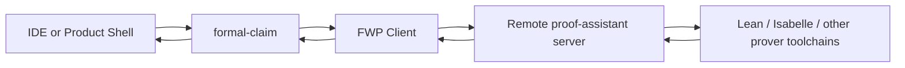

# formal-claim Stack Positioning

## Frozen Decision

`formal-claim` is not the final product shell and not the universal proof runtime.

`formal-claim` is the claim-centered orchestration assurance engine that decides
whether a result is admissible enough to become a later premise, artifact, or
promotion checkpoint.

The stable stack is:

1. `proof-assistant`
2. `FWP`
3. `formal-claim`
4. `IDE` or product shell

That ordering must remain strict even when the proof runtime moves to a remote
server.

## Canonical Runtime Topology

The target runtime hop is:

Operationally, this means:

- the IDE never canonically certifies claims by calling provers directly
- `formal-claim` remains the system of record for claim, evidence, audit,
  profile, and promotion semantics
- `FWP` transports proof work to local or remote proof runtimes
- `proof-assistant` is the machine or service that actually hosts prover
  toolchains and executes proof jobs

The proof host may be local during development and fully remote in production.
The layering must not change.

## Repository Roles

### `project/formal-claim`

Owns:

- source ingest, source mapping, and evidence normalization
- canonical claim graph, reference registry, and evaluation evidence artifacts
- admissibility policy
- proof request selection
- proof result ingestion
- deterministic audit, assurance profile, proofClaim scoring, and promotion
- canonical lineage and artifact store
- thin CLI, MCP, and demo/operator shell

Does not own:

- prover installation and lifecycle at product scale
- backend-neutral proof transport protocol definition
- the final user-facing IDE or orchestration workspace

### `project/fwp`

Owns:

- backend-neutral proof protocol
- job submission, polling, cancel, and kill semantics
- session/workspace/export contracts
- proof result envelopes and backend extension fields
- local or remote transport to proof hosts

Does not own:

- claim graphs
- evidence semantics
- assurance profiles
- promotion states
- roadmap alignment or product planning

### `project/proof-assistant`

Owns:

- actual prover toolchains
- runtime sandboxing and capacity management
- backend adapters that satisfy the FWP server contract
- remote execution environment for users who do not have Lean, Isabelle, or
  related toolchains locally installed

Does not own:

- product claim identity
- certification policy
- cross-claim assurance reasoning

### `project/ide`

Owns:

- user-facing and agent-facing shell
- roadmap synchronization
- mainline versus support-line planning
- work decomposition and multi-agent orchestration
- upload, review, and workflow UX

Does not own:

- canonical certification
- promotion semantics
- a second claim or evidence store

## Why `formal-claim` Exists

Agent frameworks answer:

- which tools an agent may call
- how tasks are delegated
- how execution is routed across agents

Guardrail-style systems answer:

- whether an output fits a schema
- whether a response violates a formatting or policy rule

The missing layer is:

- whether one agent's conclusion is strong enough to be reused as another
  agent's premise
- whether a result has enough evidence, proof lineage, and audit support to be
  promoted
- whether an operator should treat a result as draft, research-only,
  dev-guarded, or certified

That is the `formal-claim` layer. It is narrower than an IDE and broader than a
proof runner.

## Ownership Table

| Concern | Owner | Notes |
| --- | --- | --- |
| Claim extraction from text or pdf | `formal-claim` | Canonical ingest and source mapping live here. |
| Claim graph identity and revisioning | `formal-claim` | Upper shells may propose structure but do not own IDs. |
| Proof request transport | `FWP` | Includes local or remote proof job execution. |
| Prover installation and runtime | `proof-assistant` | Can be a remote service cluster. |
| Proof backend specifics | `proof-assistant` + backend adapter in `FWP` | Isabelle and Lean specifics must not leak upward as core semantics. |
| Audit/profile/promotion | `formal-claim` | Canonical admissibility decision surface. |
| Planning, roadmap sync, branch split | `IDE` | Must route certification through `formal-claim`. |
| Demo/operator UI | thin shell in `formal-claim` | Useful but not the final product shell. |

## Required Dependency Rules

These rules are not optional.

1. The IDE may propose, queue, cluster, and prioritize claims, but canonical
   admission must still go through `formal-claim`.
2. `formal-claim` may call `FWP`, but it must not directly depend on deployed
   proof-assistant internals.
3. `FWP` may route to remote proof servers, but it must not own claim or
   promotion semantics.
4. `proof-assistant` may run provers and emit proof results, but it must not
   compute assurance profiles or promotion gates.
5. No layer above `formal-claim` may create a second canonical claim store.

## What Must Stay Stable in `formal-claim`

The upper shell should be able to depend on these families of capability
without caring whether the lower proof runtime is local Isabelle today or a
remote FWP host tomorrow:

- `project.create`
- `document.ingest`
- `claim.structure`
- `formalize.dual`
- `audit.run`
- `profile.recompute`
- `promotion.transition`
- `bundle.export`
- read models for graph, references, evidence, profiles, audit reports, review
  events, and promotion history

That stability is what lets the IDE evolve independently.

## Current Local Implementation Versus Target State

`formal-claim` now reaches proof execution through the FWP client seam.

Current implementation properties:

- engine depends on a backend-neutral proof protocol client
- proof requests and job control cross the lower boundary through `FWP`
- backend-specific probe data is normalized into generic `probe_results`
  plus optional `backend_extensions`
- the old engine-local Isabelle runner shims are no longer part of the active
  workflow path

The final architecture is:

- `formal-claim` depends on a backend-neutral proof protocol client
- `FWP` provides the local and remote transport implementation
- `proof-assistant` hosts Isabelle, Lean, and later backends behind that
  protocol
- backend-specific details arrive as backend extension payloads, not as
  `formal-claim` core field names

## What Stays in the Current Desktop

The desktop should remain a thin demo and operator shell.

It is useful for:

- investor demos
- local artifact browse and inspection
- upload, split, analyze, and promotion control
- proof job control for local testing

It should not become:

- the permanent main product shell
- the owner of roadmap logic
- a second reasoning engine
- the place where proof semantics are generalized

## Consequence for Automatic Claim Organization

Automatic claim accumulation, roadmap synchronization, and mainline or support
branching still work in this architecture.

The rule is simple:

- proposal and planning may live above `formal-claim`
- canonical admission, proof-backed audit, and promotion must live inside
  `formal-claim`

So the upper shell can decide what to work on next, but it cannot decide on its
own what is certified enough to rely on.

## Strategic Position

`formal-claim` is the assurance spine between agent orchestration above and
proof execution below.

The long-term picture is:

- `proof-assistant` proves things
- `FWP` moves proof work across runtime boundaries
- `formal-claim` decides whether proof and evidence are admissible enough to
  rely on
- `IDE` decides how humans and agents use that capability inside a larger
  product

That separation is the whole point. If any one repo collapses two of those
roles back together, the system loses portability, explainability, or policy
clarity.
