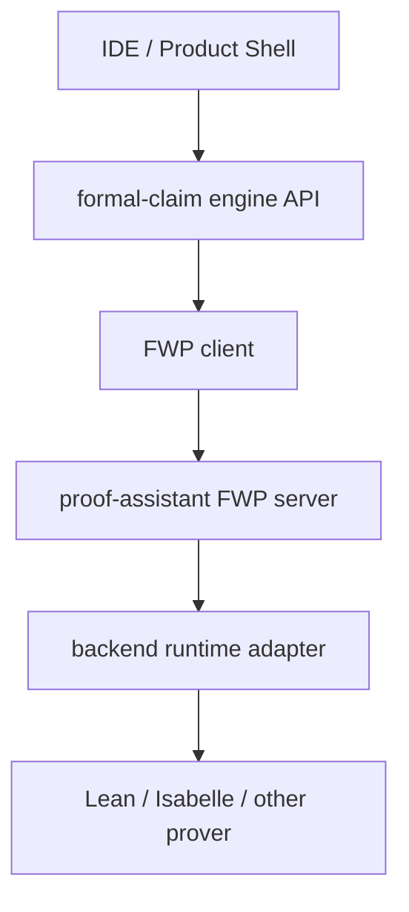

# FWP Seam Extraction Plan

## Goal

Extract a backend-neutral proof protocol seam from the current Isabelle-coupled
implementation so that `formal-claim` can submit proof work to a local runner
today and to a remote `proof-assistant` server tomorrow without changing
canonical claim, audit, profile, or promotion semantics.

This document freezes the target contract before the code is generalized.

## Scope

This plan covers:

- the seam between `formal-claim` and proof execution
- the request and result boundary that `FWP` will own
- the division of responsibility among `formal-claim`, `FWP`, and
  `proof-assistant`
- the migration path from the current local Isabelle runner

This plan does not cover:

- frontend redesign
- multi-backend product strategy beyond the seam itself
- new assurance semantics above the existing engine contracts

## Current State

`formal-claim` now reaches proof execution through the FWP client seam.

The direct engine-local Isabelle coupling points have been removed from the
active workflow path. The remaining responsibilities are:

- `services/engine/.../proof_protocol.py`
  - owns the engine-facing FWP proof adapter and normalized result envelope
- `services/engine/.../proof_control.py`
  - owns proof-job start, poll, cancel, and kill through the FWP seam
- `services/engine/.../orchestrator.py`
  - builds canonical proof requests and consumes normalized proof results
- `FWP` and `proof-assistant`
  - own transport, backend adapters, and prover-runtime specifics below the seam

This means the seam is now a first-class contract inside `formal-claim`.

## Frozen Architecture

The target dependency direction is:

### `formal-claim` owns

- deciding which claims should be formalized
- constructing proof requests from canonical claim artifacts
- mapping proof results into canonical audit/profile inputs
- promotion and admissibility decisions
- canonical artifact storage and lineage

### `FWP` owns

- proof job request and response schemas
- synchronous and asynchronous proof job control
- session/workspace/export/dump lifecycle
- transport to local or remote proof runtimes
- backend extension fields

### `proof-assistant` owns

- actual prover installation
- execution environment
- build resource limits and isolation
- backend adapter implementation that satisfies the FWP server contract

## Non-Negotiable Design Rules

1. `formal-claim` must not directly import remote proof host implementation
   details.
2. `formal-claim` must not require local Lean or Isabelle installation in the
   final deployed topology.
3. `FWP` must not learn claim graphs, promotion gates, or assurance policy.
4. `proof-assistant` must not become a second assurance engine.
5. Backend-specific details must flow through typed extension payloads, not by
   renaming `formal-claim` core fields around one prover.

## Target Core Interface

`formal-claim` should depend on a single proof execution abstraction, for
example `ProofProtocolClient`.

The exact class name may change, but the capability surface must cover these
operations:

- `submit_formalization_check(request) -> job_handle | immediate_result`
- `submit_audit_probe(request) -> job_handle | immediate_result`
- `get_job(job_id) -> proof_job_status`
- `cancel_job(job_id) -> proof_job_status`
- `kill_job(job_id) -> proof_job_status`
- `get_workspace_snapshot(ref) -> proof_workspace_snapshot`
- `list_artifacts(ref) -> proof_artifact_index`
- `read_artifact(ref) -> artifact_payload`

The client must support both:

- local in-process or CLI-backed transport
- remote HTTP, gRPC, or RPC-backed transport

The engine above this client must not care which transport is active.

## Canonical Request Boundary

`formal-claim` should produce proof requests that describe claim intent and
artifact context without assuming Isabelle-specific CLI flags.

Required request families:

### `ProofBuildRequest`

- `request_id`
- `project_id`
- `claim_id`
- `claim_graph_revision_id`
- `formal_artifact_ref`
- `target_backend`
- `target_theory`
- `target_theorem`
- `workspace_inputs`
- `resource_policy`
- `lineage`

### `ProofAuditRequest`

- all relevant build request identity
- export or dump requirements
- trust frontier requirements
- probe requirements
- robustness harness requirements
- backend extension selection

### `ProofJobControlRequest`

- `job_id`
- `requested_action`
- `actor`
- `reason`

The request boundary belongs to `FWP`, not to the engine package.

## Canonical Result Boundary

`formal-claim` should receive one backend-neutral result family plus optional
backend extensions.

Required common result fields:

- `job_id`
- `status`
- `started_at`
- `completed_at`
- `workspace_ref`
- `artifact_refs`
- `diagnostic_summary`
- `lineage`
- `resource_usage`
- `termination_reason`

Required proof evaluation fields:

- `build_success`
- `formal_artifact_ref`
- `target_theorem`
- `export_ref`
- `dependency_ref`
- `countermodel_probe_ref`
- `robustness_harness_ref`

Backend-specific details must live under something like:

- `backend_extensions.isabelle`
- `backend_extensions.lean`

Examples of fields that should move there:

- `nitpick`
- `sledgehammer`
- Isabelle-specific dependency raw payloads
- Lean-specific elaboration traces

The engine may interpret those extensions, but they must not define the core
protocol envelope.

## Remote Proof Server Assumption

The seam must explicitly support a deployment where:

- the IDE runs on a user workstation or browser shell
- `formal-claim` runs as an application service
- `FWP` routes proof work to a separate proof-assistant host
- prover binaries and heavy toolchains exist only on that host

That means the following cannot remain local-only assumptions:

- absolute local toolchain paths in engine config
- direct filesystem access from engine into prover session directories
- in-engine imports of backend runner modules
- UI assumptions that theory files must exist on the same machine as the IDE

Instead:

- proof artifacts must be referenced through artifact refs or workspace refs
- session and export data must be retrievable through the proof protocol
- engine persistence must store refs and normalized summaries, not host-local
  execution assumptions

## Migration Plan

### Phase 1: name the seam

- introduce a backend-neutral proof client interface in `services/engine`
- isolate current Isabelle runner usage behind that interface
- keep the current local runner as the first adapter

Acceptance:

- engine no longer instantiates `RunnerCliClient` or `IsabelleWrapper` directly
- orchestrator depends on the proof interface, not on Isabelle classes

Status:

- completed in `formal-claim`

### Phase 2: neutralize config

- replace `IsabelleConfig` in engine-facing config with something like
  `ProofBackendConfig` or `ProofProtocolConfig`
- move backend-specific config into adapter-specific sections

Acceptance:

- engine config no longer requires Isabelle-named fields as its primary lower
  seam

Status:

- completed in `formal-claim`

### Phase 3: normalize result envelopes

- introduce backend-neutral proof result DTOs
- move Isabelle-specific substructures into backend extension payloads
- keep current audit/profile logic working against the normalized envelope

Acceptance:

- deterministic audit can run from normalized proof results plus backend
  extensions
- core engine DTOs stop exposing Isabelle-only names as first-class fields

Status:

- completed in `formal-claim` for the lower proof seam

### Phase 4: add a remote FWP adapter

- implement a second transport adapter that talks to a remote FWP server
- keep the local Isabelle adapter as a compatibility path for development

Acceptance:

- the same engine workflow can run against local and remote proof backends by
  config switch only

### Phase 5: move deployment assumptions out of engine

- stop assuming the engine can inspect proof session directories directly
- retrieve theory files, exports, and logs through artifact or workspace refs

Acceptance:

- operator flows, MCP flows, and desktop read flows still work when proof
  execution is fully remote

## What Must Not Move Into FWP

Even after the seam is extracted, these remain `formal-claim` responsibilities:

- claim canonicalization
- evidence linkage
- external reference registry
- assurance profile computation
- proofClaim score computation
- promotion state machine
- review event journal

If any of those drift into `FWP`, the architecture is wrong.

## What May Stay Adapter-Specific

Backend adapters may still define:

- backend-specific resource knobs
- backend-specific export formats
- backend-specific probe implementations
- backend-specific raw diagnostics

But those details must be surfaced as optional extensions beneath the common
proof contract.

## Acceptance Criteria for the Seam

The seam is complete only when all of the following are true:

1. `formal-claim` can run its formalization and audit workflows without a local
   prover install on the engine host.
2. the same engine workflow can target either a local dev adapter or a remote
   proof-assistant service with no workflow code fork.
3. IDE and desktop flows do not need to know whether proof execution was local
   or remote.
4. canonical audit/profile/promotion semantics remain identical regardless of
   proof transport.
5. backend-specific diagnostics remain available through extension payloads
   without becoming core engine field names.

## Immediate Next Refactor Targets

The concrete `formal-claim` seam extraction is complete. The next work belongs
below or around this boundary:

- strengthen remote FWP transport defaults and deployment docs
- continue moving backend-specific probe semantics into `proof-assistant`
  adapters and `backend_extensions`
- generalize verifier and formalizer assumptions above the proof seam without
  reintroducing runtime coupling
